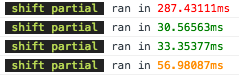
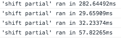

# BenchmarkToJs

This gem allows you to benchmark render times for sections of views and partials, and outputs those times to the Javascript console.

## Installation

Add this line to your application's Gemfile:

```ruby
gem 'benchmark_to_js'
```

And then execute:

    $ bundle

Or install it yourself as:

    $ gem install benchmark_to_js

## Configuration

By default, the benchmarking will only run in the Rails development environment, however this behaviour can be overridden in an initializer along with several other settings.

```ruby
# config/initializers/benchmark_to_js.rb
BenchmarkToJs.configure do |config|
  config.run_in_environments = [:development, :staging] # default [:development]

  # see below for examples on pretty enabled/disabled output
  config.pretty = true # default true

  # the following only apply if pretty if set to true
  # minimum milliseconds before time is highlighted in respective colour
  config.red_threshold = 1000   # default 500
  config.orange_threshold = 200 # default 100

  # optional; options that will be passed to `javascript_tag`. proc will be called in the context of wherever you have called `benchmark_to_js`.
  config.tag_options = Proc.new { {nonce: content_security_policy_script_nonce} }
end
```

Please note that it is **NOT** recommended to configure this gem to run your production environment!

## Usage

To use, just wrap a section of a view in a `benchmark_to_js(name)` block, like so:

### ERB
```erb
<%= benchmark_to_js("my content") do %>
  <h1>Some Header</h1>
  <%= some_intensive_methods %>
  ...
<% end %>
```

### Haml
```haml
= benchmark_to_js("my content") do
  %h1 Some Header
  = some_intensive_methods
  ...
```

Both methods will render the content as if it wasn't in the block, and a line will be logged to the Javascript console: `'my content' ran in 123.456ms`.

If pretty formatting is enabled (it is by default) then your output will look something like this:



and if it isn't, well then it will look bland, like this:



That's all there is to it!

## Development

To install this gem onto your local machine, run `bundle exec rake install`. To release a new version, update the version number in `version.rb`, and then run `bundle exec rake release`, which will create a git tag for the version, push git commits and tags, and push the `.gem` file to [rubygems.org](https://rubygems.org).

## Contributing

Bug reports and pull requests are welcome on GitHub at https://github.com/daveallie/benchmark_to_js. This project is intended to be a safe, welcoming space for collaboration, and contributors are expected to adhere to the [Contributor Covenant](http://contributor-covenant.org) code of conduct.

## License

The gem is available as open source under the terms of the [MIT License](http://opensource.org/licenses/MIT).
